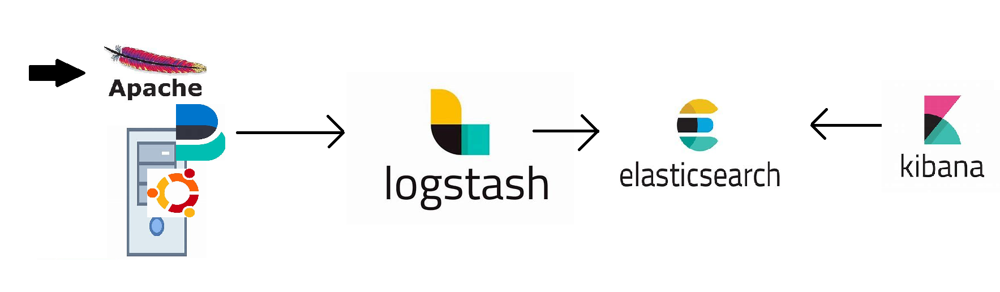

> ## Installation and Configuration of filebeat and logstash
-----------------------------------------------------------

* Basic Structure for Log Monitoring using Elastic Stack



## Prerequisites
----------------

1. We'll require 2 servers, 
   - one to install beats (filebeat), Apache2, generate some logs and forward them to logstash
   - second server will be used to configure logstash and act according to pipeline in which it'll take input (logs) from filebeat (1st server), parse the logs according to the pipeline script and forward the parsed output (logs) to elasticsearch

2. Log parsing means that the logs which are generated are in text format and if we want to search for something then searching text would be very hectic work so inorder to make it understandable, we convert these logs into some format so that they can be easily queryable in this case it's _json_ format

3. If the logs generated are already in _json_ format we can directly send them to elasticsearch/elastic cloud no need of logstash in this case

4. We can configure 2 more servers for elasticsearch & kibana respectively, but I'll be using _**[Elastic cloud](https://www.elastic.co/cloud)**_ for both of them

5. And, kibana is our UI to communicate with elasticsearch and also to perform some analysis and generate documentations about the parsed logs which we'll receive from logstash


## Let's get started
--------------------

> ### 1. Beats (Filebeat) Server Configuration
 
* Setup the Apache server on ubuntu 22.04 and check for Apache logs
```
sudo apt update && sudo apt install apache2 -y
```


* Once the Apache server is setup, we need to generate the traffic so let's create a small script

     * As mentioned in the _**[script](./files/ping.sh)**_, we'll be continuously generating logs for 2 status codes
   1. '200' which is a success message (Connection is Ok)
   2. '404' which is a failure message that's because of "/test.html" as there's no such file. Since, to generate different logs, we added "/test.html" to the script


>   * HTTP Status codes
>       * 1xx => Information
>       * 2xx => Success
>       * 3xx => Redirection
>       * 4xx => Client-side errors
>       * 5xx => Server-side errors


* Run the script from anywhere either from your local m/c or from any remote server


* Following is the output of the Apache log


* Now we need to setup beats which reads the logs written to file ```/var/logs/apache2/access.log```

    * Elastic stack has different beats


* _**[Filebeat Installations](https://www.elastic.co/guide/en/beats/filebeat/current/filebeat-installation-configuration.html)**_ 
    * * filebeat Installation using APT [Refer Here](https://www.elastic.co/guide/en/beats/filebeat/current/setup-repositories.html)
  
    * * filebeat configuration [Refer Here](https://www.elastic.co/guide/en/beats/filebeat/current/configuring-howto-filebeat.html)


> sudo apt update

> wget -qO - https://artifacts.elastic.co/GPG-KEY-elasticsearch | sudo apt-key add -

> sudo apt-get install apt-transport-https

> echo "deb https://artifacts.elastic.co/packages/8.x/apt stable main" | sudo tee -a /etc/apt/sources.list.d/elastic-8.x.list

> sudo apt-get update && sudo apt-get install filebeat


* Next, we need to update the filebeat configuration file present in ```/etc/filebeat/filebeat.yml```

```
# ============================== Filebeat inputs ===============================

filebeat.inputs:

# Each - is an input. Most options can be set at the input level, so
# you can use different inputs for various configurations.
# Below are the input-specific configurations.

# filestream is an input for collecting log messages from files.
- type: filestream

  # Unique ID among all inputs, an ID is required.
  id: Apache_filestream

  # Change to true to enable this input configuration.
  enabled: true

  # Paths that should be crawled and fetched. Glob based paths.
  paths:
    - /var/log/apache2/access.log
```
* Changes made in "filebeat.inputs" "Apache_filestream", "/var/log/apache2/access.log" and "enable input configuration: true"

* Always remember output will be sent to either Elasticsearch or Logstash not both at the same time so comment everything in ```Elasticsearch Output``` as we're dealing with logstash

```
# ================================== Outputs ===================================

# Configure what output to use when sending the data collected by the beat.

# ---------------------------- Elasticsearch Output ----------------------------
#output.elasticsearch:
  # Array of hosts to connect to.
  #hosts: ["localhost:9200"]

  # Protocol - either `http` (default) or `https`.
  #protocol: "https"

  # Authentication credentials - either API key or username/password.
  #api_key: "id:api_key"
  #username: "elastic"
  #password: "changeme"

# ------------------------------ Logstash Output -------------------------------
output.logstash:
  # The Logstash hosts
  hosts: ["10.0.0.4:5044"]

  # Optional SSL. By default is off.
  # List of root certificates for HTTPS server verifications
  #ssl.certificate_authorities: ["/etc/pki/root/ca.pem"]

  # Certificate for SSL client authentication
  #ssl.certificate: "/etc/pki/client/cert.pem"

  # Client Certificate Key
  #ssl.key: "/etc/pki/client/cert.key"

```

* Enter the logstash server's private ip address in ```hosts: ["10.0.0.4:5044"]``` assuming both the filebeat and logstash servers are on same network

* Once, the Apache server is up and running, & filebeat is also configured execute the following commands

```
sudo systemctl daemon-reload
```
```
sudo systemctl enable filebeat.service
```
```
sudo systemctl start filebeat.service
```
 
> ### 2. Logstash Server Configuration

* Let's install _**[logstash](https://www.elastic.co/guide/en/logstash/current/installing-logstash.html)**_

```
sudo apt update
```
```
wget -qO - https://artifacts.elastic.co/GPG-KEY-elasticsearch | sudo gpg --dearmor -o /usr/share/keyrings/elastic-keyring.gpg
```
```
sudo apt-get install apt-transport-https
```
```
echo "deb [signed-by=/usr/share/keyrings/elastic-keyring.gpg] https://artifacts.elastic.co/packages/8.x/apt stable main" | sudo tee -a /etc/apt/sources.list.d/elastic-8.x.list
```
```
sudo apt-get update && sudo apt-get install logstash
```

* Now we need to create a logstash pipeline to receive the logs from beats (filebeat) and send it to elastic search and also transfom the apache logs

* The tested pipeline for transforming apache logs is _**[apache.conf](./files/apache.conf)**_

* Now save this apache.conf to ```/etc/logstash/conf.d/``` and then enable and start logstash
  * How this service works is, it'll read this directory ```/etc/logstash/conf.d/``` and each & every file with ".conf" extension present in ```/etc/logstash/conf.d/``` will be executed. If we don't want a particular file to be executed just change it's extension & that file will not execute.

```
sudo systemctl enable logstash.service
sudo systemctl start logstash.service
```